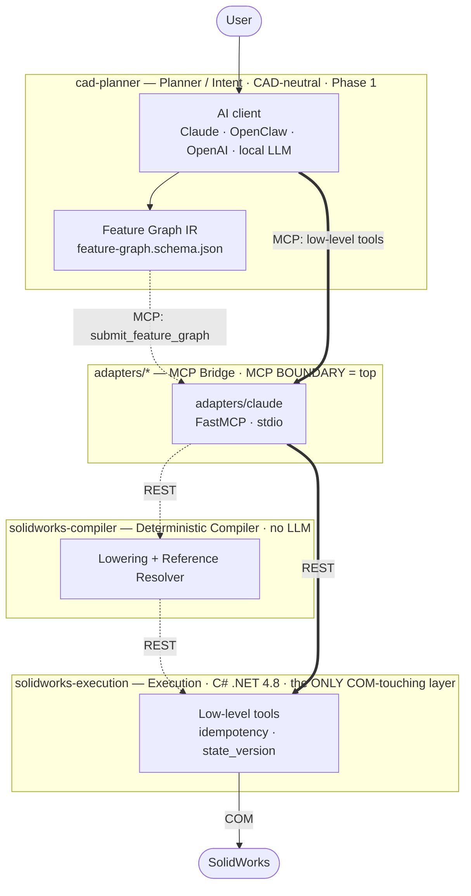

# SolidPilot

**AI-driven CAD automation for SolidWorks — an MCP (Model Context Protocol) server.**

SolidPilot lets an AI model work with SolidWorks at the **CAD feature level**. The goal is for the model to reason in terms of "which CAD intent am I realizing?" instead of "which API method should I call?". Intent is converted into a CAD-neutral intermediate representation, and a deterministic compiler lowers that representation into concrete SolidWorks operations.

SolidPilot is **not** a Claude-only plugin; it is **a general bridge between SolidWorks and AI.** Because MCP is an open standard, any MCP-capable AI client can connect — alongside Claude, OpenClaw, OpenAI-based agents, and local LLMs are also targeted. The architecture was designed for this extensibility **from the start**: the execution and planner layers do not know which client is calling them; a thin adapter per client reuses a shared bridge core. `adapters/claude/` is the current implementation; supporting a new AI client means only adding a new adapter.

> Repository: `mcp-server-solidworks` · Public name: **SolidPilot** · Target version: **SolidWorks 2026**

---

## Core Idea

The SolidWorks API exposes thousands of methods. Presenting each one to the AI as a separate "tool" explodes context size and token cost — the economic problem that stalls similar projects.

SolidPilot solves this by **raising the level of abstraction**:

- The AI produces intent at the **feature level** (for example, "put a hole in the top face").
- That intent is expressed as a CAD-neutral **Feature Graph IR**.
- A deterministic **compiler** lowers the IR into ordered, concrete SolidWorks operations.
- A single feature therefore maps to many low-level operations, and one model call per request is enough.

---

## Architecture



In the diagram, a dashed line is the target architecture (the planned IR + compiler path) and a thick line is the current working path (the AI calls the low-level tools directly; the compiler is not yet in the loop).

The system has four layers:

| Layer | Directory | Language | Responsibility |
|---|---|---|---|
| Planner / Intent | `cad-planner/` | AI model + IR schema | Turns user intent into a CAD-neutral Feature Graph IR. Never touches COM, never emits raw tool calls. |
| Compiler | `solidworks-compiler/` | Deterministic (no LLM) | Lowers the IR into ordered tool calls; resolves semantic references (e.g. `top_face`, `center`) against live geometry state. |
| Execution | `solidworks-execution/` | C# (.NET Framework 4.8) | The **only** layer that touches the SolidWorks COM API. The single source of truth for CAD state. |
| Adapter | `adapters/claude/` | Python (FastMCP) | MCP protocol bridge. The MCP boundary sits at the **top** of the system. |

**MCP sits at the top:** it is the boundary where the AI client meets the system, not an internal transport. Everything below the IR is deterministic and communicates over plain REST.

The `adapters/` layer is provider-specific and replaceable. Because the execution and planner layers do not know which client is calling, adding a new AI client (OpenClaw, OpenAI, a local LLM, etc.) means only writing a new adapter — the IR, compiler, and execution layers stay unchanged.

**Target vs. current:** the Feature Graph IR and compiler are designed but not yet built. Today the AI client uses the **low-level MCP tools** directly (the thick path); these tools will collapse into a single `submit_feature_graph` tool once the compiler lands.

---

## Tool List

The execution layer currently exposes the low-level **tools** below (the set keeps growing). All lengths are in meters (SolidWorks internal units).

### Document and lifecycle
- `ensure_ready` — launches SolidWorks via COM and attaches if it is closed (does not open a document).
- `open_new_part` — opens a new part document.
- `activate_document` — switches between open documents.
- `save_document` — saves the part to disk.
- `close_document` — closes the document.

### Sketch
- `create_sketch` — starts a sketch on a plane or a selected face.
- `edit_sketch` — reopens an existing sketch for editing.
- `add_sketch_entity` — adds a sketch entity: line, circle, arc, center arc, ellipse, spline, rectangle, fillet, chamfer.
- `add_sketch_constraint` — adds a sketch relation (horizontal, coincident, etc.).
- `add_dimension` — adds a dimension to the sketch.

### Feature and solid modeling
- `extrude_feature` — boss, cut, revolve, sweep, loft.
- `add_edge_feature` — fillet or chamfer on a solid edge.
- `add_reference_geometry` — reference plane, axis, or point.
- `create_pattern` — linear or circular pattern.
- `sheet_metal_feature` — sheet metal: base_flange, edge_flange, flat_pattern.

### Editing
- `modify_dimension` — changes the value of a named dimension (the basis for variants).
- `edit_feature` — suppresses, unsuppresses, deletes, or renames a feature.

### Material
- `set_part_material` — assigns a material to the part.

### Analysis and query
- `analyze_model` — `geometry`, `mass_properties`, `features`, `edges`, `faces`, `sketch` modes.
- `get_selection` — reads the geometry the user selected in the SolidWorks GUI and maps it to the analyze index.
- `verify_state` — returns the current state and feature tree.

### Drawing (basic / early stage)
- `create_drawing` — creates a drawing document.
- `add_drawing_view` — adds a view (isometric, front).
- `add_drawing_dimension` — adds a dimension to the drawing.

### Export
- `export_document` — STEP, STL, IGES.
- `batch_export` — batch export.

---

## Installation and Running

### Requirements
- Windows and **SolidWorks 2026**.
- **.NET Framework 4.8** and MSBuild for the execution layer (ships with Visual Studio 2022).
- **Python 3.x** and **FastMCP** for the adapter (Python dependencies are installed via `requirements.txt`).
- An MCP-capable AI client (e.g. Claude Desktop; OpenClaw, OpenAI-based agents, and local LLMs are also targeted).

### Execution layer (C#)
Build the solution:

```
& "C:\Program Files\Microsoft Visual Studio\2022\Community\MSBuild\Current\Bin\MSBuild.exe" solidworks-execution\SolidworksExecution.sln /t:Build /p:Configuration=Debug
```

Run the server (headless, `http://localhost:5000`):

```
Start-Process solidworks-execution\SolidworksExecution\bin\Debug\SolidworksExecution.exe -WindowStyle Hidden
```

### Adapter (Python)

```
cd adapters/claude
pip install -r requirements.txt
python server.py
```

The adapter connects to the execution layer at `EXECUTION_BASE_URL` (default `http://localhost:5000`; override via `.env`).

### Registering with an AI client (How to Install)

The adapter is registered with an MCP-capable AI client, which launches `server.py` itself. For **Claude Desktop**, the config file is at:

```
C:\Users\<username>\AppData\Roaming\Claude\claude_desktop_config.json
```

Add the following entry under `mcpServers`:

```json
"SolidPilot": {
  "args": ["C:\\Users\\<username>\\Desktop\\MCP Server\\adapters\\claude\\server.py"]
}
```

Update the path to match your own system.

**Restart Claude Desktop after any config change.**

> Because MCP is an open standard, OpenClaw, OpenAI-based agents, or clients running a local LLM can connect the same way by pointing to the same `server.py` adapter.

---

## Project Status

SolidPilot is a **working prototype / early alpha**. All low-level tools have been verified end-to-end against live SolidWorks; all COM calls are serialized on a single dedicated STA thread. The Feature Graph IR and compiler are designed but not yet built.

Notes:
- The Python MCP adapter does not hot-reload while running; after editing `server.py`, the MCP server must be reconnected.

---

## Roadmap

The project is under active development. The main next goals:

- **Feature Graph IR and deterministic compiler** — collapsing the low-level tools under a single feature-level interface (`submit_feature_graph`).
- **Reference resolver / persistent naming** — reliable resolution of semantic references (`top_face`, `center`, etc.) against live geometry; the project's critical module.

Support is also being developed in the following areas and is coming soon:

- **Technical drawing:** maturing the current basic drawing tools into a comprehensive, automation-ready level.
- **Assembly:** part mating, mates, component management, and bill of materials (BOM).
- **Analysis:** engineering analysis support.

---

## Contributing

For contribution guidelines, development environment setup, and the guide to adding new capabilities, see [CONTRIBUTING.md](CONTRIBUTING.md).

---

## License

Released under the [MIT License](LICENSE).
