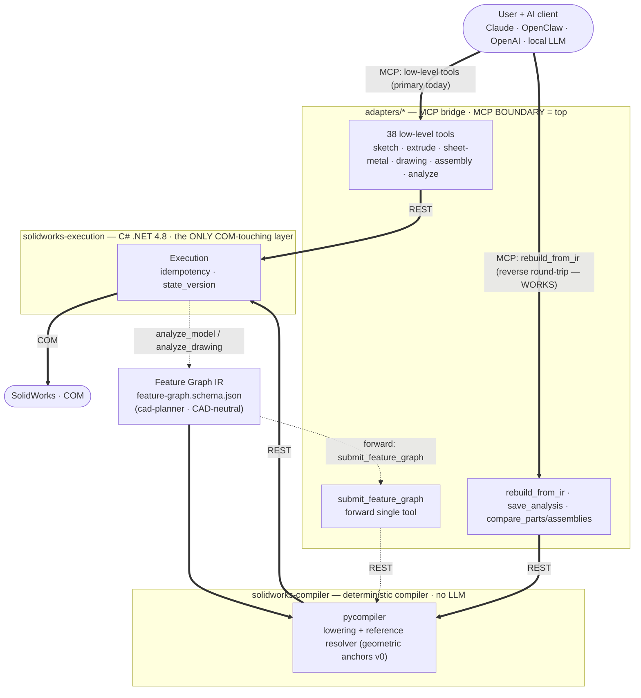

# SolidPilot

**AI-driven CAD automation for SolidWorks — an MCP (Model Context Protocol) server.**

SolidPilot lets an AI model work with SolidWorks at the **CAD feature level**. The goal is for the model to reason in terms of "which CAD intent am I realizing?" instead of "which API method should I call?". Intent is converted into a CAD-neutral intermediate representation, and a deterministic compiler lowers that representation into concrete SolidWorks operations.

SolidPilot is **not** a Claude-only plugin; it is **a general bridge between SolidWorks and AI.** Because MCP is an open standard, any MCP-capable AI client can connect — alongside Claude, OpenClaw, OpenAI-based agents, and local LLMs are also targeted. The architecture was designed for this extensibility **from the start**: the execution and planner layers do not know which client is calling them; a thin adapter per client reuses a shared bridge core. `adapters/claude/` is the current implementation; supporting a new AI client means only adding a new adapter.

> Repository: `mcp-server-solidworks` · Public name: **SolidPilot** · Target version: **SolidWorks 2026**

---

## Core Idea

The SolidWorks API exposes thousands of methods. Presenting each one to the AI as a separate "tool" explodes context size and token cost — the economic problem that stalls similar projects.

SolidPilot solves this by **raising the level of abstraction**:

- The AI produces intent at the **feature level** (for example, "put a hole in the top face").
- That intent is expressed as a CAD-neutral **Feature Graph IR**.
- A deterministic **compiler** lowers the IR into ordered, concrete SolidWorks operations.
- A single feature therefore maps to many low-level operations, and one model call per request is enough.

---

## Architecture



Read the diagram by line style: a **thick line works today**, a **dashed line is planned**. Two MCP doors are live — the low-level tools (the primary path today), and **`rebuild_from_ir`**, which drives the **real** deterministic compiler to reproduce a part — or an assembly — from its Feature Graph IR. The dotted reverse arrow is the discovery step: `analyze_model`/`analyze_drawing` read an existing part so an IR can be proposed for it. The only dashed (still-planned) piece is the *forward* collapse — a single `submit_feature_graph` tool that would replace the low-level surface for building from scratch; it runs through the same compiler.

The system has four layers:

| Layer | Directory | Language | Responsibility |
|---|---|---|---|
| Planner / Intent | `cad-planner/` | AI model + IR schema | Turns user intent into a CAD-neutral Feature Graph IR. Never touches COM, never emits raw tool calls. |
| Compiler | `solidworks-compiler/` | Deterministic (no LLM) | Lowers the IR into ordered tool calls; resolves semantic references (e.g. `top_face`, `center`) against live geometry state. |
| Execution | `solidworks-execution/` | C# (.NET Framework 4.8) | The **only** layer that touches the SolidWorks COM API. The single source of truth for CAD state. |
| Adapter | `adapters/claude/` | Python (FastMCP) | MCP protocol bridge. The MCP boundary sits at the **top** of the system. |

**MCP sits at the top:** it is the boundary where the AI client meets the system, not an internal transport. Everything below the IR is deterministic and communicates over plain REST.

The `adapters/` layer is provider-specific and replaceable. Because the execution and planner layers do not know which client is calling, adding a new AI client (OpenClaw, OpenAI, a local LLM, etc.) means only writing a new adapter — the IR, compiler, and execution layers stay unchanged.

**Current vs. target:** the Feature Graph IR and the deterministic compiler now **exist and work** — the compiler (`solidworks-compiler/pycompiler`, lowering + a v0 reference resolver) has reproduced **real production parts** end-to-end from their IR to a `verified` match (see Project Status). It is reached today through the **`rebuild_from_ir`** tool (the reverse/reproduce direction). What is still ahead is the *forward* collapse: replacing the low-level surface with a single `submit_feature_graph` tool for building from scratch, and a **durable reference resolver** that survives edits (the make-or-break module). Until then the low-level MCP tools remain the primary path for building.

---

## Tool List

The system currently exposes **46 tools** (the set keeps growing); a contract test keeps the adapter and the execution contract in exact sync (see [CONTRIBUTING.md](CONTRIBUTING.md)). Most are low-level CAD operations; a few (`save_analysis`, `rebuild_from_ir`, `submit_feature_graph`, `compare_parts`, `compare_assemblies`) drive the analysis / IR round-trip described below. All lengths are in meters (SolidWorks internal units).

### Document and lifecycle
- `ensure_ready` — launches SolidWorks via COM and attaches if it is closed (does not open a document).
- `open_new_part` — opens a new part document.
- `open_document` — opens an existing file from disk (native `.sldprt`/`.sldasm`/`.slddrw`; imports `.ipt`/`.CATPart`/STEP/IGES via 3D Interconnect when the translator is available, otherwise returns a clear `OPEN_FAILED`).
- `activate_document` — switches between open documents.
- `save_document` — saves the part or drawing to disk.
- `close_document` — closes the document.

### Sketch
- `create_sketch` — starts a sketch on a plane or a selected face.
- `edit_sketch` — reopens an existing sketch for editing.
- `add_sketch_entity` — adds a sketch entity: line, circle, arc, center arc, ellipse, spline, rectangle, fillet, chamfer.
- `add_sketch_constraint` — adds a sketch relation (horizontal, coincident, etc.).
- `add_dimension` — adds a dimension to the sketch.

### Feature and solid modeling
- `extrude_feature` — boss, cut, revolve, sweep, loft.
- `add_edge_feature` — fillet or chamfer on a solid edge (chamfer: distance-angle at any angle, or distance-distance).
- `create_rib` — rib feature from an open sketch profile.
- `add_reference_geometry` — reference plane, axis, or point.
- `create_pattern` — linear or circular pattern.
- `sheet_metal_feature` — sheet metal: base_flange, edge_flange (incl. custom-profile flanges), sketched_bend, flat_pattern.

### Editing
- `modify_dimension` — changes the value of a named dimension (the basis for variants).
- `edit_feature` — suppresses, unsuppresses, deletes, or renames a feature.

### Material
- `set_part_material` — assigns a material to the part.

### Analysis and query
- `analyze_model` — `geometry`, `mass_properties`, `bodies` (per-body fingerprints for multibody parts), `features` (a compact feature-level recipe), `edges`, `faces`, `sketch` (one sketch's exact segments on demand), and `feature_map` (per-feature consumed/created topology — the source of the reference-resolver anchors) modes.
- `get_selection` — reads the geometry the user selected in the SolidWorks GUI and maps it to the analyze index.
- `verify_state` — returns the current state and feature tree.

### Assembly
- `open_new_assembly` — opens a new blank assembly document.
- `insert_component` — inserts a part file as a component: insertion point or a full 13-number transform, fixed or floating.
- `add_mate` — adds a mate (coincident, concentric, parallel, perpendicular, tangent, distance, angle, lock) using robust **index-based** entity selection.
- `analyze_assembly` — reads components (tree order with full transforms, incl. a flattened leaf view across nesting levels), mates (creation order, locale-proof enum types, entity anchors), or one component's face/edge lists.
- `save_body_as_part` — extracts one body of a multibody part into its own part file (for flattened assembly STEP imports).
- `compare_assemblies` — objective assembly diff (component set, per-component transforms to ≤1 µm, mate count + types, mass properties) with the `verified` verdict.

### Analysis pipeline & IR round-trip
These tools implement the reverse-engineering loop — *"the LLM proposes, the round-trip decides"* — that reproduces an existing part from a CAD-neutral Feature Graph IR and objectively verifies the result.

- `get_recipe` — serves the IR-generation recipe to the model section-by-section (mapping/canonicalization rules, the Feature Graph schema, the artifact contract) — the model calls it before writing an IR.
- `save_analysis` — writes an **analysis artifact** for a part or assembly file (feature recipe / component + mate tree, driving parameters, and an optional Feature Graph IR block) to `<folder>/.solidpilot/`.
- `rebuild_from_ir` — the **reverse** IR door: runs an artifact's IR block through the deterministic compiler to rebuild the part — or assembly — in a fresh document, and warns when the source file has changed under the artifact (`source_stale`).
- `submit_feature_graph` — the **forward** IR door: builds a part or assembly from a Feature Graph supplied directly by the model (design intent, no original to copy), through the *same* compiler — two doors, one compiler.
- `compare_parts` — objective two-part diff (topology, volume, area, center of mass) with the project's `verified` verdict (topology-exact **and** |ΔV| ≤ 1% **and** |ΔA| ≤ 1%).

### Drawing
The drawing tools were added after the initial part-modeling set and are now a substantial — though still maturing — capability. They are enough to take a model to a dimensioned multi-view drawing, and to read a drawing back for reverse-engineering.

- `create_drawing` — creates a drawing document (A3 sheet).
- `add_drawing_view` — adds a model view: `front`, `top`, `right`, `isometric`, `back`, `bottom`, `left`; orthographic views default to Hidden-Lines-Visible per drafting convention (`display_mode` overridable).
- `add_flat_pattern_view` — adds a sheet-metal **flat-pattern** view (the unfolded blank with bend lines and bend notes); the correct, standard way to detail sheet-metal parts.
- `auto_dimension_drawing` — transfers the model's driving dimensions into the views (the "Insert Model Items" automation) — the robust alternative to placing dimensions by coordinate.
- `auto_center_marks` — automatically inserts center marks and centerlines on every hole/slot.
- `add_hole_callout` — adds a hole callout on a hole edge.
- `add_drawing_dimension` — adds a single dimension by sheet coordinate.
- `add_section_view` — section view along an existing edge or a drawn cut line — the standard way to expose and dimension internal/blind features (one section per distinct internal-depth axis).
- `analyze_drawing` — reads the active drawing structurally: per-view name/type/scale/position and its dimensions; with `include_geometry`, it also returns each view's **projected 2D geometry as clean primitives** (lines and curves), which is the clean shape used to reverse-engineer a part from its drawing independently of dimension-line clutter.

### Export
- `export_document` — STEP, IGES, STL, **PDF, DWG, DXF** (PDF/DWG/DXF require a drawing document).
- `batch_export` — batch export.

---

## Installation and Running

### Requirements
- Windows and **SolidWorks 2026**.
- **.NET Framework 4.8** and MSBuild for the execution layer (ships with Visual Studio 2022).
- **Python 3.x** and **FastMCP** for the adapter (Python dependencies are installed via `requirements.txt`).
- An MCP-capable AI client (e.g. Claude Desktop; OpenClaw, OpenAI-based agents, and local LLMs are also targeted).

### Execution layer (C#)
Build the solution:

```
& "C:\Program Files\Microsoft Visual Studio\2022\Community\MSBuild\Current\Bin\MSBuild.exe" solidworks-execution\SolidworksExecution.sln /t:Build /p:Configuration=Debug
```

Run the server (headless, `http://localhost:5000`):

```
Start-Process solidworks-execution\SolidworksExecution\bin\Debug\SolidworksExecution.exe -WindowStyle Hidden
```

### Adapter (Python)

```
cd adapters/claude
pip install -r requirements.txt
python server.py
```

The adapter connects to the execution layer at `EXECUTION_BASE_URL` (default `http://localhost:5000`; override via `.env`).

### Registering with an AI client (How to Install)

The adapter is registered with an MCP-capable AI client, which launches `server.py` itself. For **Claude Desktop**, the config file is at:

```
C:\Users\<username>\AppData\Roaming\Claude\claude_desktop_config.json
```

Add the following entry under `mcpServers`:

```json
"SolidPilot": {
  "args": ["C:\\Users\\<username>\\Desktop\\MCP Server\\adapters\\claude\\server.py"]
}
```

Update the path to match your own system.

**Restart Claude Desktop after any config change.**

> Because MCP is an open standard, OpenClaw, OpenAI-based agents, or clients running a local LLM can connect the same way by pointing to the same `server.py` adapter.

---

## Project Status

SolidPilot is a **working prototype / early alpha**. The low-level tools have been verified end-to-end against live SolidWorks; all COM calls are serialized on a single dedicated STA thread.

**Parts:** the part-modeling surface is the most mature — sketches, extrude/revolve/sweep/loft, fillets/chamfers, patterns, sheet metal, reference geometry, plus editing (`modify_dimension`, `edit_feature`) and rich analysis. Initially only the tools needed for part creation existed.

**Technical drawing:** added later and now a real (if still maturing) capability — multi-view drawings, section views, model-item auto-dimensioning, center marks, hole callouts, sheet-metal flat-pattern views, and a structural drawing reader. Both directions have been demonstrated on real production parts: **model → drawing** (a five-view dimensioned drawing incl. two orthogonal section views placed from analysis alone) and **drawing → model** (a part reconstructed from its drawing alone, read via `analyze_drawing(include_geometry)`, matching the original exactly in volume, surface area, and topology). Known limitation: the auto-dimension pass is drafting-blind (it can omit or mis-place dimensions and dimension hidden edges) — a smarter dimensioning layer is on the roadmap.

**Assembly:** the assembly surface now works end-to-end — creating assemblies, inserting components with full transforms, index-based mating, deep structural readback (`analyze_assembly`), and objective verification (`compare_assemblies`). An assembly IR sub-vocabulary (components + mates) has been added to the Feature Graph schema, and real sample assemblies (up to ~17 components) have been reproduced from their IR to a `verified` match: exact component sets, transforms to sub-micron, matching mate counts and types.

**Feature Graph IR + compiler (the strategic core):** now the project's spine and **working**. The IR schema (`cad-planner/contracts/feature-graph.schema.json`) and a deterministic Python compiler (`solidworks-compiler/pycompiler`, lowering + a **v0 reference resolver** built on geometric anchors) run every rebuild through one code path, with an offline test suite (no live SolidWorks needed). Via the reverse round-trip — `analyze_model` → an LLM-proposed IR → `rebuild_from_ir` → `compare_parts` — real production parts have been reproduced from their IR to a `verified` match, spanning revolves, circular patterns, both chamfer modes, lofts, and multi-bend sheet-metal forms. Each part is rebuilt in a fresh document and checked against the original by exact topology and mass properties before it counts as verified. Growing the IR vocabulary from real parts is how it advances; this effort has its own ledger (`logs-ir.md`).

The open problem — and the project's real research risk — is a **durable reference resolver**: the v0 geometric anchors reproduce a part exactly in a fresh document but do **not** survive upstream edits (a changed dimension moves the anchors). Making semantic references (`top_face`, a specific edge) robust across topology changes is the make-or-break module still ahead.

> **Two IR doors, one compiler.** The *reverse* door is `rebuild_from_ir` (reproduce an existing part from its artifact). The *forward* door is `submit_feature_graph` (build from design intent, with no original to copy) — now **live and gate-free**, and proven on real geometry: swept solids matching πr²·L to six digits, composed pattern grids, elliptic prisms, and sheet-metal flanges. Both doors execute through the same `pycompiler`, so every lesson from one improves the other. Note that having the forward door is *not* the same as collapsing the low-level surface beneath it — the 40-odd low-level tools still stand, and retiring them waits on the reference resolver below.

**Testing:** three automated suites run fully offline (no SolidWorks needed) — a **tool contract test** (`adapters/claude/tests/test_schema_contract.py`) that fails on any tool/parameter drift between the adapter (`server.py`) and the execution contract (`tool-schemas.json`); an **IR contract test** (`solidworks-compiler/pycompiler/tests/test_ir_schema_contract.py`) that fails on any vocabulary drift between the IR schema — which doubles as the capability registry — and the validator that enforces it, in both directions; and the **compiler suite** (`solidworks-compiler/pycompiler/tests/`) covering IR validation, lowering, and reference resolution against a fake execution port. Behavioral verification of the CAD operations themselves is manual against live SolidWorks, by design.

Notes:
- The Python MCP adapter does not hot-reload while running; after editing `server.py`, the MCP server must be reconnected.

---

## Roadmap

The project is under active development. The Feature Graph IR and deterministic compiler now work for parts (verified end-to-end on real production parts); the main next goals:

- **Durable reference resolver / persistent naming** — the critical module: making semantic references (`top_face`, a specific edge) survive dimension and topology changes, not just fresh-document replay. The current v0 geometric anchors are exact but edit-fragile.
- **Assembly depth** — the assembly core (insert, mate, analyze, IR round-trip) works; remaining work is subassembly hierarchies as first-class IR, mates for deformable/seated parts (e.g. o-rings in grooves), and assembly drawings / BOM.
- **Analysis pipeline breadth** — a folder scanner (batch-analyze a directory of parts/drawings into artifacts), an AI pass that generates IR per category with a coverage report, and pattern reuse across verified IRs (parametric rebuilds without an LLM).
- **Collapsing the tool surface** — the forward door (`submit_feature_graph`) is live and the IR now covers the whole part-modeling surface, so the remaining step is retiring the low-level tools beneath it. That is where the token-cost win of this architecture is actually realized; it waits on the resolver, since a single-tool interface is only usable if its references are durable.

Coming soon in existing areas:

- **Technical drawing:** the core tools exist; remaining work is a drafting-aware dimensioning layer (deterministic section planning, correct dimension placement), GD&T / datums, title blocks, detail views, and a bill of materials (BOM).

---

## Contributing

For contribution guidelines, development environment setup, and the guide to adding new capabilities, see [CONTRIBUTING.md](CONTRIBUTING.md).

---

## License

Copyright (c) 2025–2026 Çağatay Bakan.

SolidPilot is free software, licensed under the
[GNU Affero General Public License v3.0](LICENSE) (AGPL-3.0).

You may use, study, modify, and distribute it freely. Because SolidPilot is
server software, the AGPL's network clause (§13) applies: **if you run a
modified version and let others interact with it over a network, you must offer
those users the complete corresponding source of your modified version, under
the same license.** See the [LICENSE](LICENSE) for the exact terms.

### Commercial / proprietary licensing

The AGPL's copyleft obligations do not suit every organization. If you want to
embed SolidPilot in a **closed-source or proprietary product**, or otherwise
cannot comply with the AGPL, a separate **commercial license** is available.
Contributions are accepted under the project [CLA](CLA.md), which keeps this
dual-licensing option open.

**Interested in a commercial license, a pilot, or a test/evaluation program?**
Get in touch and we can arrange the right terms:

Email: **[cagataybkn@gmail.com](mailto:cagataybkn@gmail.com)**
